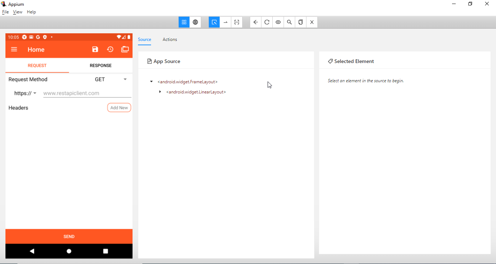
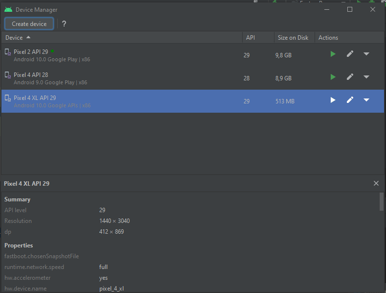

# Prueba tecnica AppGate 
## Automatizacion API-Rest desde un dispositivo Android


<p align="center">


  <a href="https://serenity-bdd.github.io/theserenitybook/latest/index.html"> 
   
  </a>
  <a href="https://cucumber.io/"> 
   
  </a>
  <a href="https://www.selenium.dev/"> 
   
  </a>
  <a href="https://gradle.org/"> 
   
  </a> 
</p>


## Casos de prueba automatizados


- Listado de casos de prueba
- consumirApiRestAndroid


## Data-driven

| Descripción  | Url|
| :------------------------------------------ | ------ |
| En el proyecto se usa como tecnica para obtener datos de un repositorio como .json, .txt, excel entre otros. El definido para esta prueba es desde Api Google| https://docs.google.com/spreadsheets/d/1tXTLynvY31fXbYLe-nbX5HvhbPLTwxTxQAK3HLhMuik/edit#gid=0 |

## Descarga del proyecto
- Acceder a la url del proyecto https://github.com/automatizaciontesting/pruebaAppgate
- Copiar el link del vinculo :  https://github.com/automatizaciontesting/pruebaAppgate.git
- Usar una herramienta para conectar y descargar el proyecto, ejemplo Gitbash


Git global setup
```sh
git config --global user.name "Hervin Camargo Carlier"
git config --global user.email "hervincamargo@gmail.com"
```
Comando clonar un proyecto existente
```sh
git clone https://github.com/automatizaciontesting/pruebaAppgate.git

```
## Patrón de diseño PO
El patron definido para esta automatización es Page Object, usando desde la  naturaleza de la clase Page Factory para realizar el mapeo de objetos y las acciones sobre la app.

En la estructura se tiene implementado

- Feature : definición de criterios de aceptación desde lenguaje de alto nivel (gherkin)
- StepDefinition: define el lenguaje como una clase que represente la naturaleza, de ahí se define los pasos o secuencia, dado que en gherkin lo definimos declarativo
- Steps: definimos los pasos con los cuales vamos a realizar las acciones en el page
- Page: representa la pagina, esta es usada para realizar las acciones y que desde el driver al ser sobreescrito podamos adherir y manipular los objetos

## Ambientar maquina windows y conectar android virtual device
Debemos como precondición descargar appium server GUI e appium inspertor de los siguientes enlace
- appium server https://github.com/appium/appium-desktop/releases/tag/v1.22.2 , usar el instalador Appium-Server-GUI-windows-1.22.2.exe
 
 

- appium inspector https://github.com/appium/appium-inspector/releases/tag/v2022.3.2
  
  
 
- Ruta de los instaladores src\test\resources\appiumInstallers
- Para ambientar maquina debemos instalar previamente android studio desde el siguiente link: https://developer.android.com/studio?gclid=CjwKCAjw9LSSBhBsEiwAKtf0nxcoeIXD6F86cCma8U9xghT-qE3mpaWpsIvExUOujQnJH0Y0AVDbBBoCEEMQAvD_BwE&gclsrc=aw.ds
- Una vez descargado debemos crear las variables de entorno
  
  
- Crear desde android virual device un emulador con caracteristicas api 29 (android 10)

  
  
  
  
 
- Listar dispositivos conectados o emulados por medio de adb devices
  
- Configuración de serenity.properties
  
- Instalar un apk en nuestro dispositivo emulado o virtual por medio del comando como el siguiente:

  adb -s emulator-5556 install C:\Users\usuarioWindows\AppData\Local\Android\Sdk\platform-tools\Apks\nombreApk


Comando Push en proyecto existente
```sh
cd eltiempo
git init
git remote add origin https://github.com/automatizaciontesting/pruebaAppgate.git
git add .
git commit -m "Initial commit"
git push -u origin master
```
Como ejecutar el proyecto

| Ruta | Acción |
| ------ | ------ |
| \src\test\java\com\appgate\runners | ejecutar el runner de la funcionalidad, dando clic derecho sobre la clase|
| Consola cmd en la raíz del proyecto | ejecutar comando: gradle clean test -Dtags=nombreTag , el nombre del tag se encuentra en el feature anterior a la definición del escenario. |


# Licencias

MIT
Open-Source

**Free Software!**